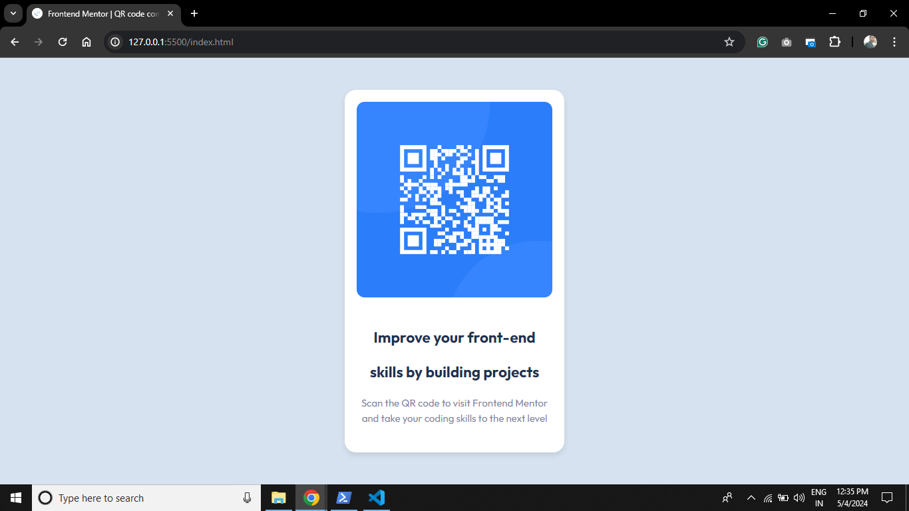

# Frontend Mentor - QR code component solution

This is a solution to the [QR code component challenge on Frontend Mentor](https://www.frontendmentor.io/challenges/qr-code-component-iux_sIO_H). Frontend Mentor challenges help you improve your coding skills by building realistic projects.

## Table of contents

- [Overview](#overview)
  - [Screenshot](#screenshot)
  - [Links](#links)
- [My process](#my-process)
  - [Built with](#built-with)
  - [What I learned](#what-i-learned)
  - [Continued development](#continued-development)
  - [Useful resources](#useful-resources)
- [Author](#author)
- [Acknowledgments](#acknowledgments)

## Overview

### Screenshot



### Links

- Solution URL: [Add your solution URL here](https://github.com/yourusername/qr-code-component)
- Live Site URL: [Add your live site URL here](https://your-live-site-url.com)

## My process

### Built with

- Semantic HTML5 markup
- CSS custom properties
- Flexbox

### What I learned

In this project, I learned how to create a responsive QR code component using HTML and CSS. I practiced layout techniques with Flexbox and implemented custom styles for a clean and modern design.

```html
<div class="container">
    <div class="card">
      
      <div class="text">
        <h2>Improve your front-end skills by building projects</h2>
        <p>Scan the QR code to visit Frontend Mentor and take your coding skills to the next level</p>
      </div>
      <p class="attribution">Challenge by <a href="https://www.frontendmentor.io" target="_blank">Frontend Mentor</a>. Coded by <a href="https://www.linkedin.com/in/avinash-mahato-58944b193" target="_blank">Avinash Kumar Mahato</a>.</p>
    </div>
  </div>
```
### Continued development
I plan to continue focusing on responsive design techniques and exploring more advanced CSS features like CSS Grid for future projects.

### Useful resources

- [MDN Web Docs](https://developer.mozilla.org/en-US/)
- [Frontend Mentor](https://www.frontendmentor.io)

## Author

- LinkedIn - [Avinash Kumar Mahato](https://www.linkedin.com/in/avinash-mahato-58944b193)
- Frontend Mentor - [@AvinashKumarMahato](https://www.frontendmentor.io/profile/AvinashKumarMahato)

## Acknowledgments

I would like to thank Frontend Mentor for providing this challenge and the community for their valuable feedback and support.